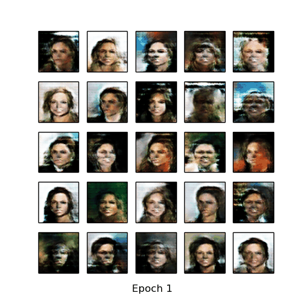
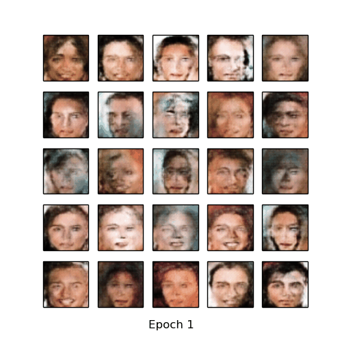
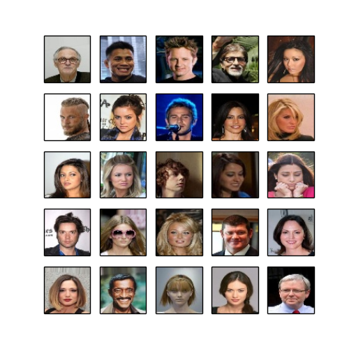
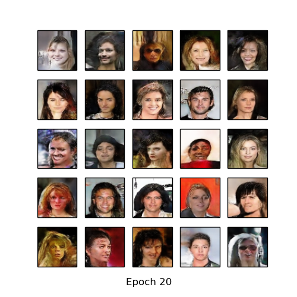
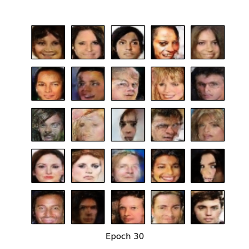

<!-- #region -->
# CelebA-DCGAN


* In case you wish  to train using cropped CelebA dataset, you have to change isCrop = False to isCrop = True.

I will train a generative adversarial network (GAN) to generate new
celebrities after showing it pictures of many real celebrities.

GANs are a framework to capture the data’s distribution. So we can generate new data from that same distribution. 

They are made of two distinct models, a *generator* and a
*discriminator*.  The job of generator - spawn ‘fake’ images liking like the training images. The job of the discriminator - look
at the output and decide whether or not it is a real training image or a
fake one. 


### Loss Functions and Optimizers

I will use the Binary Cross Entropy loss.

Next, I  define real label (1) and the fake label (0). These
labels will be used when calculating the losses
Then, I set 2 optimizers, one for $D$ and
one for $G$.

I will generate a fixed batch
of latent vectors from a Gaussian distribution.


### Training

I will construct different mini-batches for real and false
images, and also adjust G target function to maximize
$logD(G(z))$.

 1 - Train the Discriminator 

Goal of training the discriminator - maximize the
probability of correctly classifying a given input as real or false. 
First, I
will construct a batch of real samples from the train set, forward
pass through $D$, calculate the loss then
calculate the gradients. Secondly, I will construct
a batch of false samples with the generator, forward pass and calculate the loss
and accumulate the gradients with a backward. Then, I call for the Discriminator optimizer.

 2 - Train the Generator 

I want to train the Generator by
minimizing $log(1-D(G(z)))$ to generate better falses.

At the end, I do statistic at the end of each
epoch and pull our noise batch through the generator to see the progress of G training.


* download:

  - CelebA dataset: http://mmlab.ie.cuhk.edu.hk/projects/CelebA.html

* pytorch_CelebA_DCGAN.py requires 64 x 64 size image, so I resized CelebA with celebA_data_preprocess.py.
* pytorch_CelebA_DCGAN.py added learning rate with weihgt decay.


<!-- #endregion -->

## Resutls

### CelebA
* Generate using fixed noise:

<table align='center'>
<tr align='center'>
<td> DCGAN </td>
<td> DCGAN crop </td>
</tr>
<tr>
<td>
<td>
</tr>
</table>

* CelebA vs Generated images

<table align='center'>
<tr align='center'>
<td> CelebA </td>
<td> DCGAN after 20 epochs </td>
<td> DCGAN crop after 30 epochs </td>
</tr>
<tr>
<td>
<td>
<td>
</tr>
</table>


```python

```
